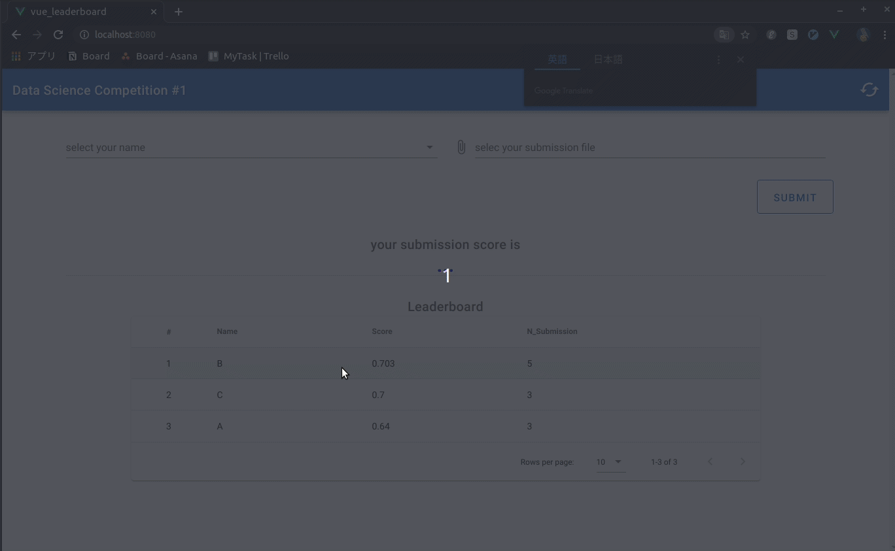

# kagglelike-leaderboard

ローカルで動かすようです。  
本番環境(このリポジトリとは関係ないですが)は、githubpages で vue を使って、
バックエンドは heroku にflask api を用意しました。
heroku は無料でデータベース(postgreSQL)も使えるので利用しました。



## 実行
1. cd kagglelike-leaderboard/
1. npm run serve
1. cd kagglelike-leaderboard/bkend
1. python3 api.py
1. ブラウザで、localhost:8080

## python3 setup
1. cd data
1. pip3 install -r requirements.txt

## Project setup
```
npm install
```

### Compiles and hot-reloads for development
```
npm run serve
```

### Compiles and minifies for production
```
npm run build
```

### Lints and fixes files
```
npm run lint
```

### Customize configuration
See [Configuration Reference](https://cli.vuejs.org/config/).
